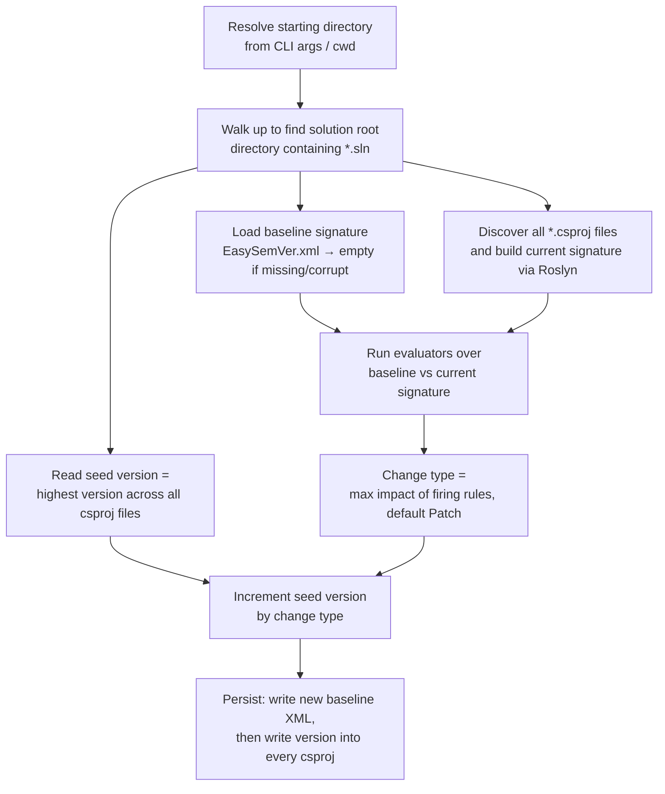

# 01 — Overview

## Product statement

EasySemVer (`Winterborn.Library.EasySemVer`) is a lightweight build-time utility for C#
solutions that **automatically computes and applies Semantic Versioning** based on changes to
the code's public API surface, and **keeps every version counter in the solution in sync**
(assembly version, package version, file version, across all projects).

A consuming team adds the NuGet package to one project, wires it into the build, and seeds
their `.csproj` files with a starting version. From then on, each versioned build:

1. extracts a structural **signature** of the solution's public API,
2. diffs it against the signature saved by the previous run,
3. classifies the diff as a **Major**, **Minor**, or **Patch** change per SemVer,
4. increments the version accordingly, and
5. writes the new version into every project file and saves the new signature as the baseline
   for the next run.

## Core concepts

| Term | Meaning |
|------|---------|
| **Solution root** | The nearest ancestor directory of the starting directory that contains a `.sln` file. All discovery is rooted here. |
| **Signature** | A structural model of the public API surface: projects → classes → methods (with overload parameter lists) and properties. See [05-signature-extraction.md](05-signature-extraction.md). |
| **Baseline** | The signature persisted from the previous run, stored as `EasySemVer.xml` in the solution root. See [06-signature-persistence.md](06-signature-persistence.md). |
| **Evaluator** | A rule object that inspects (baseline, current) signatures and reports whether a specific kind of difference is present, plus the SemVer impact of that difference. See [07-change-classification.md](07-change-classification.md). |
| **Version properties** | The three `.csproj` properties kept in sync: `AssemblyVersion`, `PackageVersion`, `FileVersion`. |
| **Change type** | One of `Major`, `Minor`, `Patch` ([`VersionType`](../src/EasySemVer/DataObject/VersionType.cs)). |

## Foundational design decisions

**OVR-01 — Signature diff, not source diff.** ✅
Change detection SHALL be based on comparing structural API signatures between runs — not on
git history, commit messages, file timestamps, or binary diffing. The signature is the single
source of truth for "what the public API was."

**OVR-02 — One version per solution.** ✅
The entire solution SHALL share a single version. The seed is the *highest* version found
anywhere in the solution (see [VER-06](08-version-model.md)), and the incremented result is
written to *every* project. Per-project independent versioning is out of scope.

**OVR-03 — Every run is a release.** ✅
Each successful run SHALL increment the version by at least a Patch — there is no "no change"
outcome. The tool assumes it runs only for builds that represent releases; the README
therefore recommends gating the build hook on `Configuration == Release`
([README.md](../README.md), step 5), keeping dev-loop builds from bumping versions and
causing merge conflicts.

**OVR-04 — Opt-in, non-invasive version writing.** ✅
The tool SHALL only update version properties that already exist in a `.csproj`; it never adds
them. Teams opt in per project and per property by seeding values
([README.md](../README.md), step 4; [SYN-03](09-version-synchronization.md)).

**OVR-05 — Self-healing baseline.** ✅
A missing or unreadable baseline SHALL never fail the run; it is treated as "no history," and
a fresh baseline is written. See [PER-03/PER-04](06-signature-persistence.md).

## Processing pipeline

Implemented in [`Program.Execute`](../src/EasySemVer/Program.cs):

Steps C, D, E are independent inputs; step I is the only mutating step and runs last, so a
failure before persistence leaves the working tree untouched.

## Non-goals (current implementation)

- Languages other than C# (see *Future direction* below).
- Pre-release / build-metadata version segments (`1.2.3-beta.1+sha`); versions are plain
  dotted integers.
- Per-project or per-package independent version streams.
- Git/VCS awareness of any kind.
- API surface beyond public classes: interfaces, structs, enums, delegates, events, and
  fields are not modeled yet (explicit `TODO`s in
  [`SolutionBuilder`](../src/EasySemVer/CodeReader/SolutionBuilder.cs); see
  [SIG-10](05-signature-extraction.md) and gap **G-15**).
- Configuration files / tuning knobs; behavior is fixed by
  [`MagicValues`](../src/EasySemVer/Settings/MagicValues.cs).

## Future direction (non-normative)

The next planned evolution changes the invocation contract from "C# solution" to "**a
folder**": the command will take a directory, detect the languages present (C#, Java, Kotlin,
Swift, C++, Objective-C, …), extract comparable signatures per language, and keep each
ecosystem's native version artifacts in sync from the same computed version. The specs in
this folder describe the C#-only baseline that rework starts from; the language-neutral parts
(version model, classification rules, baseline persistence, "one version per tree") are the
pieces expected to survive that generalization.
