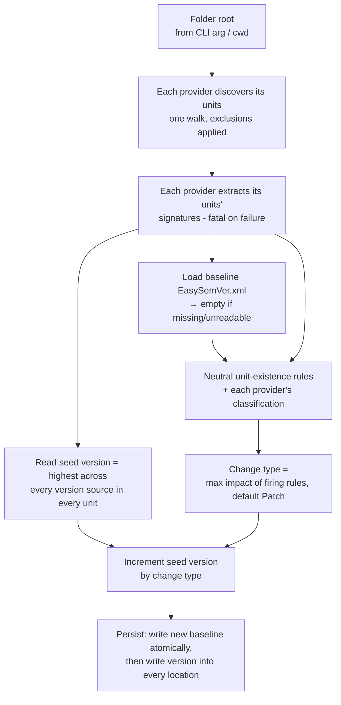

# 01 — Overview

## Product statement

EasySemVer (`Winterborn.Tools.EasySemVer`) is a lightweight build-time utility that takes **a
folder**, **automatically computes and applies Semantic Versioning** based on changes to the
public API surface of everything inside it, and **keeps every version counter in that folder in
sync** across every language it finds.

C# and Swift are supported today; the language seam is designed so a third is a provider plus a
registration line (see [12](12-multi-language-swift-and-folder-model.md) §3).

A consuming team points the tool at a folder and seeds a starting version somewhere in it. From
then on, each versioned build:

1. extracts a structural **signature** of every packageable unit's public API, in that unit's
   own language,
2. diffs it against the signature saved by the previous run,
3. classifies the diff as a **Major**, **Minor**, or **Patch** change per SemVer,
4. increments the version accordingly, and
5. writes the new version into every version location that already exists, in every language,
   and saves the new signature as the baseline for the next run.

## Core concepts

| Term | Meaning |
|------|---------|
| **Folder root** | The directory handed to the CLI. The unit of versioning. There is no walk-up and no `.sln` requirement. |
| **Packageable unit** | One independently shippable module: a `.csproj`, a SwiftPM target, an Xcode target. The atom of add/remove detection and of version write-back. |
| **Language provider** | The pluggable per-language implementation: discovery, extraction, classification, version read/write. |
| **Signature** | A structural model of one unit's public API surface, **in that language's own topology**. C# has projects → classes/interfaces/structs/records/enums/delegates → members; Swift has modules → structs/classes/actors/enums/protocols → members. Neither is expressed in the other's vocabulary. See [05-signature-extraction.md](05-signature-extraction.md). |
| **Baseline** | The signatures persisted from the previous run, stored as `EasySemVer.xml` in the folder root. See [06-signature-persistence.md](06-signature-persistence.md). |
| **Evaluator** | A rule object that inspects (baseline, current) signatures and reports whether a specific kind of difference is present, plus the SemVer impact of that difference. See [07-change-classification.md](07-change-classification.md). |
| **Version locations** | Every place a version already lives: `.csproj` properties, `MARKETING_VERSION`, `CFBundleShortVersionString`, a `.podspec`, a generated Swift constant, git tags. See [08](08-version-model.md). |
| **Change type** | One of `Major`, `Minor`, `Patch` ([`VersionType`](../src/EasySemVer/DataObject/VersionType.cs)). |

## Foundational design decisions

**OVR-01 — Signature diff, not source diff.** ✅
Change detection SHALL be based on comparing structural API signatures between runs — not on
git history, commit messages, file timestamps, or binary diffing. The signature is the single
source of truth for "what the public API was."

**OVR-02 — One version per folder.** ✅ *(generalized by ML-06)*
The entire folder SHALL share a single version, regardless of how many languages or units it
contains. The seed is the *highest* version found anywhere in it (see
[VER-06](08-version-model.md)), and the incremented result is written to *every* location that
already exists. A Swift-only change therefore moves the C# projects' versions too. Per-unit or
per-language independent version streams are out of scope.

**OVR-03 — Every run is a release.** ✅
Each successful run SHALL increment the version by at least a Patch — there is no "no change"
outcome. The tool assumes it runs only for builds that represent releases; the README
therefore recommends gating the build hook on `Configuration == Release`
([README.md](../README.md), step 5), keeping dev-loop builds from bumping versions and
causing merge conflicts.

**OVR-04 — Opt-in, non-invasive version writing.** ✅ *(generalized by MVR-04)*
The tool SHALL only update version locations that already exist; it never creates one. A
`.podspec` without a literal version, an Xcode target without `MARKETING_VERSION`, a package
with no version file — all are read-skipped and write-skipped. Teams opt in per location by
seeding values ([README.md](../README.md); [SYN-03](09-version-synchronization.md)).

**OVR-05 — Self-healing baseline.** ✅
A missing or unreadable baseline SHALL never fail the run; it is treated as "no history," and
a fresh baseline is written. See [PER-03/PER-04](06-signature-persistence.md).

## Processing pipeline

Implemented in [`VersioningRun.Execute`](../src/EasySemVer/Evaluation/VersioningRun.cs):

Discovery runs exactly once and its result feeds every downstream stage. Step I is the only
mutating step and runs last, so a failure before persistence — including a Swift extraction
failure — leaves the working tree untouched.

## Non-goals (current implementation)

- Languages other than C# and Swift. The seam exists for more
  ([ML-02](12-multi-language-swift-and-folder-model.md)); nothing else is implemented.
- Pre-release / build-metadata version segments (`1.2.3-beta.1+sha`); versions are plain
  dotted integers.
- Per-unit or per-language independent version streams.
- Writing git tags. Tags are read as a seed input and never created (§20 O-02).
- Build counters as *seeds*. `CURRENT_PROJECT_VERSION` is written so it keeps moving, but it is
  never read back as a version (MVR-06, §20 O-01).
- Configuration files / tuning knobs; behavior is fixed by
  [`MagicValues`](../src/EasySemVer/Settings/MagicValues.cs). The one exception is the
  `--dry-run` flag (§20 O-04).

## Implemented in doc 12

The folder-based invocation contract, the per-language native topologies, the serializable
baseline, and Swift support all landed with
[12-multi-language-swift-and-folder-model.md](12-multi-language-swift-and-folder-model.md).
This document describes the result.
